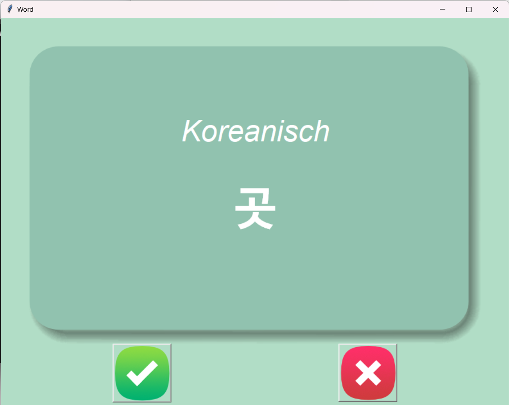
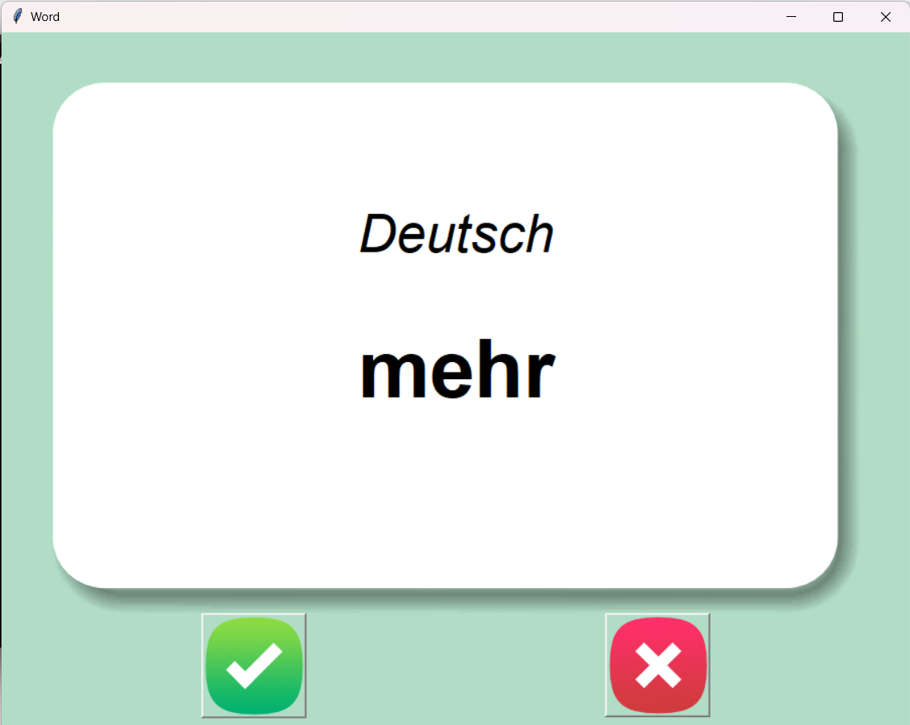

# Flash Card App

This is a simple flashcard application built using Python and Tkinter. It allows users to learn vocabulary words by displaying them on flashcards, where they can see the word in one language and try to recall its translation in another language.

## Features

- **Randomized Flashcards**: The app displays flashcards with random vocabulary words.
- **Two-Sided Flashcards**: Each flashcard has two sides, showing the word in one language on the front and its translation in another language on the back.
- **Learn and Review**: Users can flip the flashcards to see the translation and indicate whether they know the translation or not.
- **Data Persistence**: Progress is saved by removing learned words from the dataset, so users can continue learning from where they left off.

## Default Vocabulary

- **Korean-German Word List**: The default vocabulary consists of Korean words with their corresponding German translations.

## Vocabulary Management

- **Customize Vocabulary**: Users can modify the vocabulary by editing the CSV file. They can add new words or remove existing ones according to their learning needs.

## How to Use

1. **Ensure Folders**: Before running the executable file, make sure that the `data` folder and `images` folder are located in the same directory as the executable.
2. **Download and Run the App**: [Download Flash Card App](https://drive.google.com/file/d/1i6DQUVALRu-rHBPloqCy5fgDZqR6jAQJ/view?usp=drive_link) and run it. The flashcard app window will appear.
3. **View Flashcards**: Each flashcard will display a word in one language. Try to recall its translation in the other language.
4. **Flip the Card**: Click on the flashcard to flip it and reveal the translation.
5. **Indicate Knowledge**: Click the "Right" button if you knew the translation, or the "Wrong" button if you didn't.
6. **Continue Learning**: The app will continue to display new flashcards and review learned words.

## Download Links

- **Executable File**: [Download Flash Card App](https://drive.google.com/file/d/1i6DQUVALRu-rHBPloqCy5fgDZqR6jAQJ/view?usp=drive_link)
- **Words to Know CSV**: This file contains the vocabulary words. Users can modify it as needed.

## Screenshots

